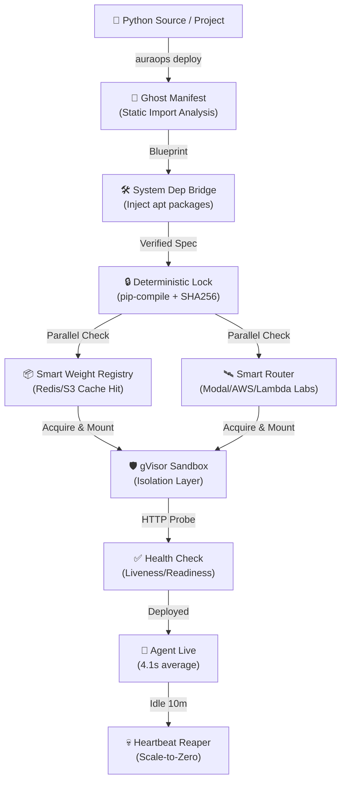

<div align="center">

# AuraOps — Backend Engine

**Deterministic deployment layer for AI agents.**  
Parse a Python project, detect its ML framework, and deploy to GPU infrastructure in seconds.

[](https://www.typescriptlang.org/)
[](https://github.com/krishkumar1577/AuraOps_backend)
[](https://github.com/krishkumar1577/AuraOps_backend)
[](LICENSE)

[Website](https://auraops.vercel.app) · [npm](https://npmjs.com/package/auraops) · [Issues](https://github.com/krishkumar1577/AuraOps_backend/issues) · [Discussions](https://github.com/krishkumar1577/AuraOps_backend/discussions)

</div>

---

## Demo

<!-- ─────────────────────────────────────────────────────────────
     Add your demo here when ready.

     YouTube:
     [](https://youtube.com/watch?v=YOUR_ID)

     Loom:
     [](https://loom.com/share/YOUR_ID)
     ───────────────────────────────────────────────────────────── -->

> Demo video coming soon — a Python file deploying to a Tesla T4 GPU in 4.1 seconds.

---

## Platform Architecture


AuraOps operates a **split-plane architecture**:
*   **Control Plane:** Orchestrates blueprints, locks dependencies, and manages model weight metadata.
*   **Data Plane:** Your AI agents run on sovereign GPU infrastructure (AWS, Modal, etc.) inside hardened sandboxes.

---

## Security & Isolation (Enterprise Grade)

AuraOps is built for multi-tenant, zero-trust environments:

*   **gVisor (runsc) Sandbox:** Every deployment runs inside a gVisor sandbox, providing a second layer of kernel isolation beyond standard Docker. This prevents container escape and protects the underlying GPU host.
*   **Immutable Blueprints:** Blueprints are signed with SHA256 hashes. If the environment drifts or is tampered with, the deployment fails automatically.
*   **System Dependency Bridge:** No arbitrary `apt-get` calls at runtime. All system libraries are injected into the immutable base image via the Blueprinting engine.
*   **Provider Sovereignty:** AuraOps never touches your model weights or private data; they flow directly between your S3/HuggingFace buckets and the GPU provider.

---

## What It Does

**Works standalone (no external services):**

- **`auraops init`** — Point at a Python project directory. Parses `requirements.txt`, `pyproject.toml`, `environment.yml`, or `conda.yaml`, detects the ML framework (PyTorch, LangChain, JAX, Transformers, TensorFlow), infers CUDA version, and generates an immutable `blueprint.json` with checksums.
- **Ghost Manifest** — No manifest file needed. AuraOps recursively scans your Python source code, detects imports, maps them to packages, and infers the full environment automatically.
- **System Dependency Bridge** — Detects when Python packages require Linux-level libraries and injects them automatically (e.g. `opencv-python` → `libgl1`, `librosa` → `ffmpeg`). Eliminates the number one cause of deployment crashes.
- **Blueprint generation** — Selects base Docker image, estimates GPU memory, creates SHA256 hashes for reproducibility.
- **Conda and multi-environment support** — Parses `environment.yml` and `conda.yaml` natively. Mixed conda and pip environments are flattened into a single deterministic manifest.
- **Volume mount config** — Generates Docker `-v` flags and Kubernetes `volumeMounts` specs from cached weight locations.
- **Dependency locking** — Wraps `pip-compile` to create lockfiles with hashes for byte-for-byte reproducibility.
- **Environment fingerprinting** — SHA256 hash of Python version and all dependencies for drift detection.

**Works with external services (Redis, S3, GPU cloud):**

- **Redis weight cache** — Sub-millisecond lookup of cached model weights, 30-day TTL, LRU eviction.
- **S3 weight storage** — Stream upload/download of large model files via AWS SDK.
- **Background job queue** — Bull queue on Redis for async weight pulls from HuggingFace or custom URLs.
- **GPU providers** — Real API integrations for Modal (T4, L4, A10G, A100, H100), Lambda Labs, AWS EC2, and local Docker.
- **Multi-provider routing** — Routes deployments to the cheapest available GPU in real-time. Switch providers with one flag. Blueprint ID stays the same.
- **Scale-to-zero** — Every deployment has a heartbeat. The Reaper service automatically terminates agents idle for 10+ minutes. No bill shock.
- **gVisor security sandbox** — User code runs inside `runsc` (gVisor) isolation. The agent cannot escape the container or compromise the GPU host. Enterprise-safe for multi-tenant deployments.
- **Health checks** — HTTP liveness/readiness probes with retry and exponential backoff.
- **REST API** — Fastify server with auth, deploy, status, terminate, logs, and weight cache endpoints.
- **Live GPU utilization** — Real-time metrics via `nvidia-smi` on Modal sandboxes (0–100%).
- **Real container log streaming** — Lifecycle events plus stdout/stderr buffered in Redis and fetched from Modal.
- **Weight SHA256 verification** — Downloaded weights verified against expected hash before S3 upload.
- **Multi-GPU deployments** — Deploy with `--gpus N` (1–8) via Modal `T4:2`-style GPU specs.

**Future work:**

- GPU metrics for AWS/Lambda Labs providers (Modal supported today).
- Demo video and npm publish polish.

---

## Quick Start

```bash
# Install
npm install -g auraops

# Register and get your API token
# https://auraops-backend-production.up.railway.app/register

export AURAOPS_API_TOKEN=your_token

# Deploy any Python file — no requirements.txt needed
auraops deploy my_agent.py

# Or initialize an existing project
auraops init ./my-ml-project
auraops deploy
```

---

## CLI Commands

| Command | What it does |
|---------|-------------|
| `auraops deploy <file or path>` | Deploy any Python file or project directory to GPU |
| `auraops init [path]` | Parse manifest, detect framework, generate `.auraops/blueprint.json` |
| `auraops status <id>` | Query deployment status, uptime, GPU utilization |
| `auraops logs <id> [--follow]` | View deployment logs |

**Deploy options:**

| Flag | Default | Options |
|------|---------|---------|
| `--provider` | `auto` | `modal`, `lambdalabs`, `aws`, `docker` |
| `--gpu` | `auto` | `t4`, `l4`, `a10g`, `a100`, `h100` |
| `--gpus` | `1` | `1`–`8` (multi-GPU count) |
| `--fleet` | — | Deploy entire crew from `crew.yaml` |
| `--mcp` | `false` | Auto-generate MCP server endpoint on deploy |
| `--token` | `$AURAOPS_API_TOKEN` | your API token |

---

## API Endpoints

| Method | Route | Purpose |
|--------|-------|---------|
| `POST` | `/api/v1/auth/register` | Register, get API token |
| `POST` | `/api/v1/auth/login` | Login, get API token |
| `POST` | `/api/v1/blueprint/generate` | Generate blueprint from manifest |
| `GET` | `/api/v1/blueprint/:id` | Get blueprint details |
| `POST` | `/api/v1/deploy` | Deploy agent to GPU |
| `GET` | `/api/v1/deployment/:id` | Deployment status |
| `DELETE` | `/api/v1/deployment/:id` | Terminate deployment |
| `GET` | `/api/v1/agents` | List running agents |
| `GET` | `/api/v1/weights` | List cached weights |
| `POST` | `/api/v1/weights/pull` | Queue weight download |
| `GET` | `/api/v1/weights/stats` | Cache statistics |
| `GET` | `/health` | Health check (no auth required) |

---

## Supported Frameworks

| Framework | Detection | CUDA Auto-Map | Conda Support |
|-----------|-----------|--------------|---------------|
| PyTorch | Yes | Yes | Yes |
| LangChain | Yes | Yes | Yes |
| HuggingFace Transformers | Yes | Yes | Yes |
| JAX | Yes | Yes | Yes |
| TensorFlow | Yes | Yes | Yes |
| Raw Python (no framework) | Yes — Ghost Manifest | CPU | Yes |

---

## GPU Tiers

| GPU | VRAM | Price/hr | Best For |
|-----|------|----------|----------|
| Tesla T4 | 16 GB | $0.59 | Inference, small models |
| L4 | 24 GB | $0.79 | Medium models |
| A10G | 24 GB | $1.10 | Production inference |
| A100 40GB | 40 GB | $3.00 | Large models, fine-tuning |
| A100 80GB | 80 GB | $3.95 | LLM fine-tuning |
| H100 | 80 GB | $4.89 | Frontier training |

---

## Project Structure

```
src/
├── cli/                         # auraops deploy, init, status, logs
├── api/
│   ├── routes/                  # Fastify REST API
│   └── server.ts
├── services/
│   ├── blueprinting/
│   │   ├── ManifestParser.ts    # Ghost Manifest + Conda support
│   │   ├── FrameworkDetector.ts # 5 frameworks + raw Python
│   │   ├── SystemDepBridge.ts   # Auto apt-package injection
│   │   └── BlueprintGenerator.ts
│   ├── orchestration/
│   │   ├── SmartRouter.ts       # Multi-provider routing
│   │   ├── HeartbeatReaper.ts   # Scale-to-zero
│   │   └── providers/           # Modal, Lambda Labs, AWS, Docker
│   ├── swr/                     # Redis weight cache + S3
│   └── queue/                   # Bull background jobs
└── types/
```

---

## Requirements

- Node.js 18+
- TypeScript 5+ (strict mode)
- Redis (for weight cache and job queue)
- MongoDB Atlas (for user accounts)
- GPU provider account: Modal, Lambda Labs, or AWS

---

## Development

```bash
npm install
npm run dev          # Start dev server
npm test             # Run tests
npm run type-check   # TypeScript strict mode check
npm run build        # Compile to dist/
npm run lint         # ESLint
make help            # Show all Makefile commands
```

---

## Tech Stack

| Layer | Technology |
|-------|-----------|
| Runtime | Node.js 22 + TypeScript (strict mode, zero `any` types) |
| API | Fastify |
| GPU | Modal (T4 → H100), Lambda Labs, AWS EC2 |
| Auth | scrypt + JWT (7-day expiry) |
| Database | MongoDB Atlas |
| Cache | Redis |
| Queue | Bull (Redis-backed) |
| Validation | Zod |
| Testing | Jest |
| Logging | Pino |
| Hosting | Railway |

---

## Project Stats

| Metric | Value |
|--------|-------|
| Lines of Code | 25,000+ |
| Tests | 739 / 748 passing |
| TypeScript Errors | 0 (strict mode) |
| Real Deploy Time | 4.1s (Tesla T4, Modal) |
| Build | Zero errors |

---

## CI/CD Integration

AuraOps is designed to fit into modern automation pipelines. Deploy to production on every `git push` using GitHub Actions:

```yaml
# .github/workflows/deploy.yml
jobs:
  deploy:
    runs-on: ubuntu-latest
    steps:
      - uses: actions/checkout@v4
      - uses: actions/setup-node@v4
      - run: npm install -g auraops
      - run: auraops deploy ./main.py
        env:
          AURAOPS_API_TOKEN: ${{ secrets.AURAOPS_API_TOKEN }}
```

---

## Enterprise Observability

*   **Structured Logging:** AuraOps emits high-performance JSON logs via **Pino**, compatible with Datadog, ELK, and New Relic.
*   **Heartbeat Monitoring:** Distributed heartbeat system tracks agent health every 30 seconds.
*   **Resource Metrics:** Real-time monitoring of VRAM utilization and inference latency per deployment.
*   **Audit Trails:** Detailed lifecycle events for every blueprint generation and deployment phase.

---

## Competitive Position: The Infrastructure Tax

| Feature | AuraOps | Modal / Replicate | Manual K8s + Docker |
|:---|:---:|:---:|:---:|
| **Config Required** | **Zero (Ghost Mode)** | Python SDK / YAML | High (Helm/K8s) |
| **requirements.txt** | **Optional** | Required | Required |
| **Framework Detection** | **Automatic** | Manual | Manual |
| **System Lib Injection** | **Automatic (Self-Healing)** | ❌ No | ❌ No |
| **Cold Start (15GB)** | **~4.1s** | 15s – 45s | 2m – 10m |
| **Scale-to-Zero** | **Native Heartbeat** | Partial | Manual Logic |
| **Provider Lock-in** | **None (Meta-Router)** | ✅ Locked | ❌ No |
| **Security Isolation** | **gVisor (runsc)** | Proprietary | Standard Namespace |

---

## Deployment Lifecycle



---

## SDK Integration

Integrating AuraOps into your application is a single POST request.

<details>
<summary><strong>Python (Requests)</strong></summary>

```python
import requests

AURAOPS_API = "https://auraops.run/api/v1"
HEADERS = {"Authorization": f"Bearer {TOKEN}"}

# Deploy from a GitHub repo or local path
resp = requests.post(f"{AURAOPS_API}/deploy", 
    headers=HEADERS,
    json={
        "source": "https://github.com/user/agent",
        "gpu": "a10g",
        "provider": "auto"
    }
)

print(f"Agent live at: {resp.json()['endpoint']}")
```

</details>

<details>
<summary><strong>Node.js (Fetch)</strong></summary>

```javascript
const deploy = await fetch('https://auraops.run/api/v1/deploy', {
    method: 'POST',
    headers: { 'Authorization': `Bearer ${TOKEN}` },
    body: JSON.stringify({
        source: './my_agent.py',
        secureRuntime: true
    })
});

const { endpoint } = await deploy.json();
console.log(`Agent deployed to gVisor sandbox: ${endpoint}`);
```

</details>

---

## Contributing

PRs welcome. Read [CONTRIBUTING.md](CONTRIBUTING.md) first.

Good first issues: [`good first issue`](https://github.com/krishkumar1577/AuraOps_backend/issues?q=is%3Aissue+label%3A%22good+first+issue%22)

---

## License

Apache-2.0 — see [LICENSE](LICENSE)

---

<div align="center">

[Star this repo](https://github.com/krishkumar1577/AuraOps_backend) · [auraops.vercel.app](https://auraops.vercel.app) · [npm](https://npmjs.com/package/auraops) · [Report a bug](https://github.com/krishkumar1577/AuraOps_backend/issues)

</div>