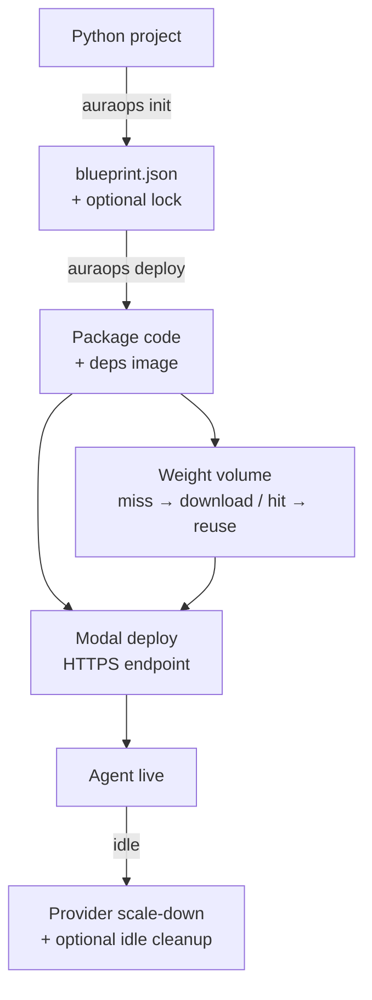

<div align="center">

# AuraOps — Backend Engine

**Deploy your Python AI agent to GPU without writing the infra yourself.**  
Point at a project → we detect the framework, lock the environment, package *your* code, and ship it to GPU (Modal-first).

[](https://www.typescriptlang.org/)
[](https://github.com/krishkumar1577/AuraOps_backend)
[](LICENSE)
[](https://www.npmjs.com/package/auraops)

[Website](https://auraops.vercel.app) · [npm](https://npmjs.com/package/auraops) · [Issues](https://github.com/krishkumar1577/AuraOps_backend/issues) · [Discussions](https://github.com/krishkumar1577/AuraOps_backend/discussions)

</div>

---

## Why AuraOps

Most “deploy my agent” tools either:

1. force you to write Docker / CUDA / provider SDK glue, or  
2. run a **demo shell** that is not actually your repo.

AuraOps is the middle path:

| You care about | What AuraOps does |
|----------------|-------------------|
| **Your code ships** | Local (and server) deploy packages the project and loads your entrypoint |
| **Less env hell** | Manifest parse, framework detection, optional lockfile, system-lib hints → Modal image |
| **Sensible defaults** | Modal-first GPU path; CLI asks for missing tokens instead of failing silently |
| **Honest iteration speed** | First deploy may take minutes (cold image/deps); warm redeploys are usually much faster |

We optimize for **time-to-working-agent** and **repeatable deploys**, not a stopwatch fantasy.

---

## What to expect on timing (real)

These are engineering ranges for `auraops deploy` to Modal — not a guaranteed SLA.

| Path | Typical wall clock | Notes |
|------|--------------------|--------|
| `auraops init` | **~1–15s** | Parse + detect + write blueprint |
| **Warm / cached** redeploy (small agent, deps already built) | **~30–90s** | Modal schedule + package + start |
| **Cold first deploy** (pip / image build) | **~1–3 min** | Network + dependency install dominates |
| Cold + **first multi‑GB weight pull** | **several minutes** | First fill of the weight volume; later hits can skip re-download |
| Hard fail | Configurable (`MODAL_DEPLOY_TIMEOUT_MS`, default **10 min**) | Raise if cold pip/image builds still time out |

**First deploy is almost always the cold path.** After the environment and weights are cached, iteration gets much closer to the warm range.

Progress you should feel:

1. Blueprint / package project  
2. `modal deploy` (build or reuse image)  
3. Optional weight download into shared volume  
4. Live HTTPS endpoint  

---

## Demo

<!-- Add Loom / YouTube when ready -->

> Demo video coming soon — real project → blueprint → Modal URL, with cold vs warm timing called out (not a fake 4s stopwatch).

---

## Quick Start (recommended path)

**Local Modal deploy packages your code.** You need a [Modal](https://modal.com) account and tokens.

```bash
# Optional global CLI
npm install -g auraops
# or: npx auraops ...

# 1) Analyze project → .auraops/blueprint.json
auraops init ./my-agent-project

# 2) Deploy (default = local Modal CLI)
# If MODAL_TOKEN_ID / MODAL_TOKEN_SECRET are missing, the CLI prompts for them.
export MODAL_TOKEN_ID=...
export MODAL_TOKEN_SECRET=...

# Optional: agent API keys injected into the Modal runtime
export OPENAI_API_KEY=...

auraops deploy
# or: auraops deploy -b ./my-agent-project/.auraops/blueprint.json
```

**Hosted API path** (packs a code bundle; keep models out of the zip):

```bash
export AURAOPS_API_TOKEN=...   # CLI prompts if missing (interactive terminal)
auraops deploy --server --token "$AURAOPS_API_TOKEN"
```

Server body size: set `MAX_REQUEST_BODY_BYTES` ≥ **32MB**. Bundles auto-skip weight/data files and use a **~25MB** code budget after skips.

---

## What It Does (accurate)

### Works offline / local (no Redis required for init)

- **`auraops init`** — Parses `requirements.txt`, `pyproject.toml`, conda env files; detects frameworks (PyTorch, LangChain, LangGraph, CrewAI, Transformers, JAX, TensorFlow); estimates GPU tier; writes immutable `blueprint.json` with checksums.
- **Ghost Manifest** — If no requirements file, scans Python imports and maps common packages (best-effort; not every PyPI name).
- **System dependency hints** — Maps packages → apt libs (e.g. opencv → `libgl1`) and injects them into the **Modal image build** when present on the blueprint.
- **Dependency locking** — Best-effort `pip-compile` → `requirements.lock` (warns and continues if pip-tools is missing).
- **Entrypoint detection** — Finds a real entry file; at runtime discovers `crew` / `graph` / `agent` / `run` / … or falls back to running the script (`AURAOPS_INPUT` + stdout).

### Deploy to GPU (Modal-first)

- **Packages your project** into the Modal app (`add_local_dir` → `/app`), not only a framework scaffold.
- **Framework scaffold remains a fallback** if user code cannot be loaded.
- **Secrets / env** — Common keys (`OPENAI_API_KEY`, etc.) or Modal secrets; optional `AURAOPS_AGENT_ENV` JSON.
- **Weight “fridge”** — Remote `customModels` (S3/HTTP) download into a shared Modal Volume on first miss; later deploys can hit cache.
- **Multi-GPU** — `--gpus 1..8` (Modal-style specs).
- **MCP** — Optional `--mcp` exposes tool routes on the same Modal URL; Claude Desktop config printed when enabled.
- **CLI credentials** — Interactive prompts for Modal tokens and API JWT when missing (non-interactive/CI fails clearly).

### Control plane (optional Redis / S3 / hosted API)

- JWT auth, deploy/status/logs/terminate routes  
- Redis-backed deployment records and weight metadata registry  
- S3 helpers for weight storage  
- Provider adapters: **Modal** (primary user-code path), **Lambda Labs** (when API key set), **AWS / Azure** (credential-gated; not full parity with Modal user-code deploy yet)

---

## Security & isolation (what is actually true)

- **Cloud isolation** — Modal (and other clouds) use **their** container sandboxing. AuraOps does not wrap every cloud job in gVisor.
- **gVisor (runsc)** — Available when using the **local Docker provider** and `runsc` is installed on the host.
- **Blueprints** — SHA256 fingerprints for environment drift detection; treat them as integrity helpers, not a full supply-chain attestation product.
- **Weights & secrets** — Prefer Modal secrets for production keys. Project bundles skip `.env` and large model files; put weights on S3/HF and reference them via blueprint `customModels`.

---

## CLI Commands

Use `npx auraops …` if the package is not installed globally.

| Command | What it does |
|---------|--------------|
| `auraops init [path]` | Parse project → `.auraops/blueprint.json` (+ optional lockfile) |
| `auraops deploy` | Deploy blueprint (default: **local Modal**, packages project) |
| `auraops deploy --server` | Deploy via hosted API + project code bundle |
| `auraops status <id>` | Deployment status (API) |
| `auraops logs <id> [--follow]` | Logs (API) |
| `auraops terminate <id>` | Stop Modal app (API) |
| `auraops fleet <crew.yaml>` | Multi-agent crew deploy (API) |

**Useful deploy flags:**

| Flag | Meaning |
|------|---------|
| `-b, --blueprint <path>` | Blueprint path (default `.auraops/blueprint.json`) |
| `--server` | Hosted API instead of local Modal CLI |
| `-p, --provider <name>` | `auto` / `modal` / `azure` / `aws` (full user-code path is **Modal-first**) |
| `--gpus <n>` | GPU count 1–8 |
| `--mcp` | MCP routes + Claude Desktop snippet |
| `--token <jwt>` | API token for hosted commands |

---

## Supported frameworks

| Framework | Detected | Notes |
|-----------|----------|--------|
| PyTorch / Transformers | Yes | Default model load paths are configurable via blueprint |
| LangChain / LangGraph | Yes | User graph preferred; scaffold fallback if needed |
| CrewAI | Yes | Agent/tool heuristics + GPU tiering |
| JAX / TensorFlow | Yes | Best-effort loaders; bring a clear entrypoint |
| Raw Python | Yes | Ghost scan + script front door (`AURAOPS_INPUT`) |

---

## GPU tiers (Modal selection guide)

Indicative hourly prices used for routing defaults (not a live global market feed).
**Prices come from provider APIs when available** (Lambda Labs instance-types, AWS Pricing API);
**Modal uses the guide map unless overridden** (`MODAL_PRICE_T4`, `AURAOPS_GPU_PRICE_JSON`).

| GPU | VRAM | ~$/hr (guide) | Typical use |
|-----|------|---------------|-------------|
| T4 | 16 GB | ~0.59 | Small agents / light inference |
| L4 | 24 GB | ~0.79 | Medium workloads |
| A10G | 24 GB | ~1.10 | Production-ish inference |
| A100 | 40–80 GB | ~3–4 | Larger models |
| H100 | 80 GB | ~4.89 | Heavy training / large models |

---

## Architecture (mental model)

```
Python project
    → init: parse + detect + blueprint (+ lock)
    → deploy: package code + deps image + optional weight volume
    → Modal (primary): live HTTPS endpoint
    → optional: Redis/S3 control plane, other providers (partial)
```

- **Control plane:** blueprints, auth, deploy records, weight metadata, API.  
- **Data plane:** your agent process on the GPU provider; weights preferred via S3/HF → provider volume/cache.

Deep dive: [`docs/architecture/code-map.md`](docs/architecture/code-map.md) · CLI map: [`docs/cli/cli-code-map.md`](docs/cli/cli-code-map.md)

---

## API (hosted)

| Method | Route | Purpose |
|--------|-------|---------|
| `POST` | `/api/v1/auth/register` | Register |
| `POST` | `/api/v1/auth/login` | Login → JWT |
| `POST` | `/api/v1/blueprint/generate` | Generate blueprint |
| `GET` | `/api/v1/blueprint/:id` | Fetch blueprint |
| `POST` | `/api/v1/deploy` | Deploy (optional `projectBundleBase64`) |
| `GET` | `/api/v1/deployment/:id` | Status |
| `DELETE` | `/api/v1/deployment/:id` | Terminate |
| `GET` | `/api/v1/agents` | List agents |
| `GET` | `/api/v1/weights` | Weight cache list |
| `POST` | `/api/v1/weights/pull` | Queue weight pull |
| `GET` | `/health` | Liveness (no auth) |

Default production API (subject to change): see your deployment URL / `AURAOPS_API_URL`.

---

## Requirements

| Use case | Need |
|----------|------|
| **init only** | Node 18+ |
| **Local deploy** | Node 18+, Modal CLI + `MODAL_TOKEN_ID` / `MODAL_TOKEN_SECRET` |
| **Hosted API** | JWT (`AURAOPS_API_TOKEN`); server needs Redis (and Modal tokens for real GPU) |
| **Weight cache plane** | Redis + optional S3 |

---

## Development

```bash
npm install
npm run dev           # API server
npm run test:unit     # Fast unit suite
npm test              # Full suite (unit + integration)
npm run type-check
npm run build
npm run lint          # 0 errors required in CI
```

---

## Tech stack

| Layer | Choice |
|-------|--------|
| Language | TypeScript (strict) |
| API | Fastify + Zod + JWT |
| CLI | Commander |
| GPU (primary) | Modal |
| Other providers | Lambda Labs, AWS, Azure (partial depth) |
| Cache / queue | Redis, Bull |
| Users | MongoDB |
| Logging | Pino |
| Tests | Jest |

---

## Project status (honest)

| Item | Reality |
|------|---------|
| Maturity | **Alpha** (`0.1.x`) — useful CLI path; APIs still evolving |
| Primary deploy path | **Local Modal + user project packaging** |
| Tests | **800+** automated tests; run `npm test` locally for current count |
| Coverage badge | Not advertised as a hard % — coverage is good on core paths, not “95%+ everywhere” |
| Typecheck | Clean (`tsc --noEmit`) |
| Azure / AWS | Adapters exist; **not** full “your agent code” parity with Modal |
| Live cheapest-GPU market | **Partial** — guide prices + configured providers, not a global exchange |

---

## Competitive position (fair comparison)

| | AuraOps | Raw Modal / Replicate-style | Hand-rolled Docker/K8s |
|--|---------|-----------------------------|-------------------------|
| Understand Python agent repo | **Yes (init / ghost scan)** | You write it | You write it |
| Ship **your** code by default | **Yes (Modal path)** | You wire mounts | You wire mounts |
| System lib hints | **Yes (into image)** | Manual | Manual |
| First cold deploy | Minutes (normal for deps) | Similar if you pip/build | Often longer |
| Warm iteration | Often **under ~1–2 min** | Can be similar when cached | Depends on your pipeline |
| Multi-cloud story | Modal-first; others partial | Single vendor | DIY |
| Isolation story | Provider sandbox; gVisor **local** | Vendor sandbox | DIY |

We do **not** claim “4s cold start with a 15GB model” as a product guarantee. We claim **less glue, real packaging, and honest tradeoffs.**

---

## Deployment lifecycle



---

## MCP (optional)

```bash
auraops deploy --mcp
```

Exposes MCP-style routes on the Modal URL (e.g. `/mcp/tools`, `/mcp/tools/call`). Claude Desktop config can be printed after deploy. Prefer the **Modal endpoint** for tool calls; stdio wrappers need `AURAOPS_AGENT_URL` if used separately.

---

## CI example

```yaml
# .github/workflows/deploy.yml
jobs:
  deploy:
    runs-on: ubuntu-latest
    steps:
      - uses: actions/checkout@v4
      - uses: actions/setup-node@v4
        with:
          node-version: 20
      - run: npm install -g auraops
      - run: auraops init .
      - run: auraops deploy
        env:
          MODAL_TOKEN_ID: ${{ secrets.MODAL_TOKEN_ID }}
          MODAL_TOKEN_SECRET: ${{ secrets.MODAL_TOKEN_SECRET }}
          AURAOPS_NONINTERACTIVE: "1"
          # OPENAI_API_KEY: ${{ secrets.OPENAI_API_KEY }}
```

Use `AURAOPS_NONINTERACTIVE=1` in CI so missing secrets fail fast instead of waiting on a prompt.

---

## Known limitations

- **Cold deploys** can take several minutes; AuraOps kills `modal deploy` after **`MODAL_DEPLOY_TIMEOUT_MS`** (default **10 minutes**, min 1 min / max 30 min). Raise the env var for heavy first builds, or use pre-warmed images.
- **Server bundles** are for **code** (~25MB after skipping models); put large weights on S3/HF + `customModels`.
- **Azure/AWS** are not full Modal-parity user-code deploys yet.
- **Live cross-cloud price ranking** is incomplete.
- **gVisor** is not applied to every cloud deploy.
- **Alpha APIs** may change before 1.0.

---

## Contributing

PRs welcome. See [CONTRIBUTING.md](CONTRIBUTING.md).

Good first issues: [`good first issue`](https://github.com/krishkumar1577/AuraOps_backend/issues?q=is%3Aissue+label%3A%22good+first+issue%22)

---

## License

[Apache 2.0](LICENSE)
