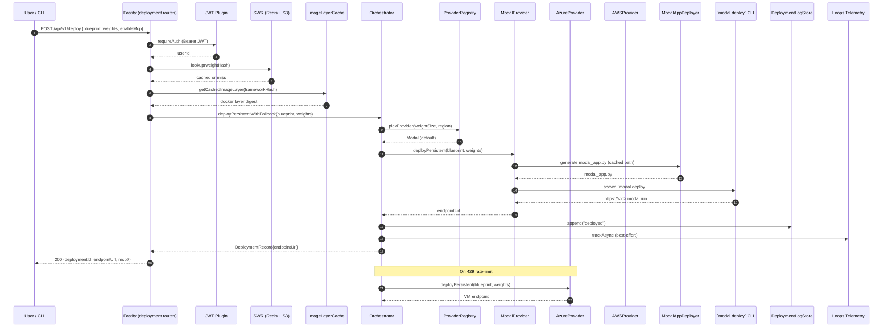
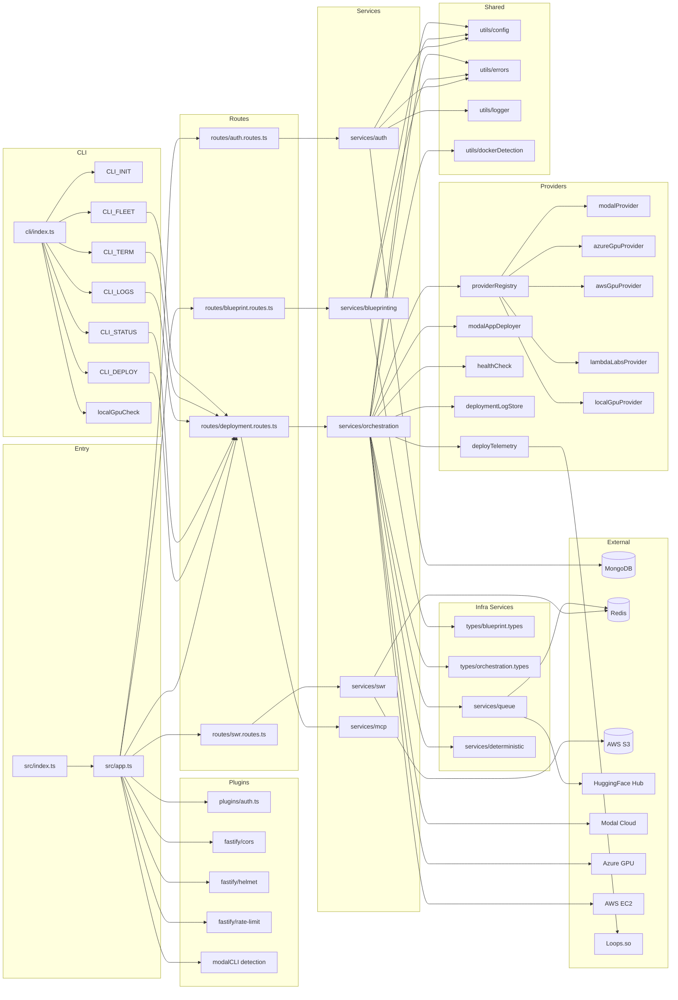
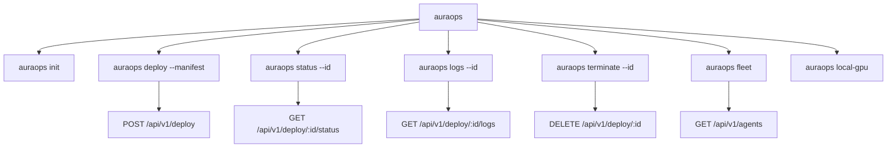
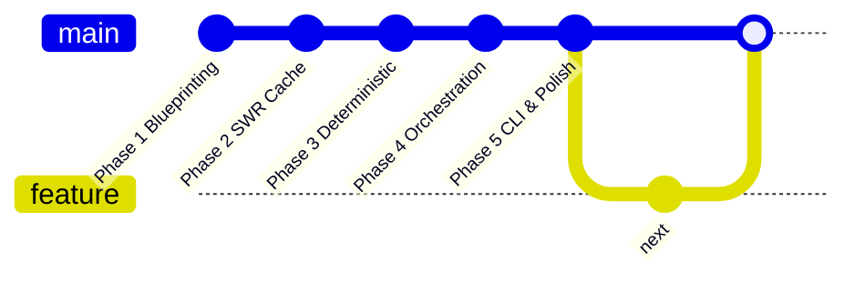

# AuraOps Backend — Workflow Code Map / Mind Map

Generated from full repo context. Stack: TypeScript (strict) · Fastify · MongoDB · Redis · Bull · AWS SDK · Modal SDK · Zod · Pino · Commander.

## Legend

```
mindmap
  root((AuraOps Backend))
    Entry
      src/index.ts
        startServer
      src/app.ts
        Fastify
        @fastify/jwt
        @fastify/cors
        @fastify/helmet
        @fastify/rate-limit
        registerRoutes
        modalCLIDetected
    Bootstrap
      utils/config.ts
        Zod env schema
        JWT_SECRET required in prod
        MONGODB_URI
        REDIS_URL
        AWS_REGION
        AWS_ACCESS_KEY_ID
        AWS_SECRET_ACCESS_KEY
        MODAL_TOKEN_ID
        MODAL_TOKEN_SECRET
        AZURE_SUBSCRIPTION_ID
        LOOPS_API_KEY
        PORT
      utils/logger.ts
        Pino structured
      utils/errors.ts
        AuraOpsError
        ValidationError
        NotFoundError
        FrameworkDetectionError
        ManifestParsingError
        DeploymentError
        AuthenticationError
        ConflictError
        WeightVerificationError
    Auth
      api/routes/auth.routes.ts
        POST /api/v1/auth/register
        POST /api/v1/auth/login
      services/auth/passwordService.ts
        scrypt hash
        verify
      services/auth/userRepository.ts
        MongoDB users
      services/auth/jwtService.ts
        sign verify
      plugins/auth.ts
        Fastify JWT hook
        requireAuth
        rateLimitAuth
    Phase 1 Blueprinting
      api/routes/blueprint.routes.ts
        POST /api/v1/blueprint/generate
        GET /api/v1/blueprint/:id
      services/blueprinting
        manifestParser.ts
          requirements.txt
          pyproject.toml
          Detect deps
        frameworkDetector.ts
          PyTorch
          TensorFlow
          JAX
          HuggingFace Transformers
          vLLM
          TGI
        frameworkDetectors/langGraphDetector.ts
          LangGraph
        pythonSourceScanner.ts
          AST scan
          import detection
        blueprintGenerator.ts
          Blueprint JSON
          Immutable spec
        types/blueprint.types.ts
          Blueprint
          DetectedFramework
          ResourceSpec
    Phase 2 Smart Weight Registry
      api/routes/swr.routes.ts
        GET /api/v1/weights
        GET /api/v1/weights/:hash
        POST /api/v1/weights/pull
        GET /api/v1/weights/stats
      services/swr
        redisClient.ts
          lookup less than 1ms
          register
          stats
          evictLRU
        s3Manager.ts
          upload less than 20s for 15GB
          download less than 15s for 15GB
          exists
        volumeMounter.ts
          generateDockerMounts
          generateK8sMounts
        imageLayerCache.ts
          Docker layer dedupe
          KRI-19
    Phase 3 Deterministic
      services/deterministic
        dependencyLocking.ts
          pip-compile
          Lockfile
        hashVerifier.ts
          SHA256 env hash
    Phase 4 Orchestration
      api/routes/deployment.routes.ts
        POST /api/v1/deploy
        GET /api/v1/deploy/:id/status
        DELETE /api/v1/deploy/:id
        GET /api/v1/deploy/:id/logs
        GET /api/v1/agents
        POST /api/v1/deploy/:id/stop-modal
        GET /api/v1/deploy/:id/mcp/card
        GET /api/v1/deploy/:id/mcp/config
        GET .well-known/mcp/:id.json
      services/orchestration/orchestrator.ts
        acquireWorker
        releaseWorker
        deployAgent
        getDeploymentStatus
        terminateAgent
        cleanupIdleDeployments
        deployPersistentModal
        deployPersistentWithFallback
        stopPersistentModal
        DeploymentRecord CRUD
        DeploymentLogStore integration
      services/orchestration/defaultOrchestrator.ts
        createDefaultOrchestrator
        Wires providers
      services/orchestration/providerRegistry.ts
        Rank by price
        KRI-21
      services/orchestration/deployProviderFallback.ts
        Modal to Azure on 429
      services/orchestration/healthCheck.ts
        Verify endpoint
      services/orchestration/deploymentLogStore.ts
        Redis lists
        24h TTL
        5000 entries cap
      services/orchestration/deployTelemetry.ts
        KRI-9
      services/orchestration/modalAppDeployer.ts
        Generate modal_app.py
        Cached path
        Non-cached path
        Framework loaders
        MCP ASGI stub
        Spawn modal deploy CLI
        120s timeout
        Parse modal.run URL
      services/orchestration/providers
        baseProvider.ts
          Interface
        modalProvider.ts
          ModalClient
          Sandbox
          App deploy
        lambdaLabsProvider.ts
          Optional
        azureGpuProvider.ts
          Azure SDK
        awsGpuProvider.ts
          EC2 SDK
        localGpuProvider.ts
          Local dev
      services/orchestration/crewParser.ts
        CrewAI YAML
      services/orchestration/workerPool
        warmWorkerPool.ts
        Modal sandboxes
        EC2 pool
        Azure pool
    MCP
      services/mcp
        mcpCardGenerator.ts
          Build server card
        mcpEndpointGenerator.ts
          ASGI stub
          /mcp/health
          /mcp/tools
          /mcp/tools/call
    Queue
      services/queue
        backgroundJobs.ts
          Bull on Redis
          queueWeightPull
          3 retries
          Exponential backoff
          HuggingFace or URL
          Upload to S3 and register
        queueAutoscaler.ts
          KRI-20
    Fleet and Telemetry
      services/fleet
        Fleet manager
        Health aggregator
      services/telemetry
        Loops client
        Async non-blocking
    CLI
      src/cli/index.ts
        Commander
        init deploy status logs terminate fleet
      src/cli/init.ts
        Generate manifest template
      src/cli/deploy.ts
        POST deploy
        Wait for status
      src/cli/status.ts
        GET status
      src/cli/logs.ts
        GET logs lifecycle and container
      src/cli/terminate.ts
        DELETE cleanup
      src/cli/fleet.ts
        List agents
      src/cli/localGpuCheck.ts
        Probe local GPU
    External Systems
      Modal Cloud
        Persistent App
        Sandbox
        modal deploy CLI
        *.modal.run URL
      Azure
        AzureML GPU VMs
        Fallback target
      AWS
        EC2 GPU pool
        S3 weight bucket
        Pricing API
        Lambda optional
      Redis
        Auth and rate limit
        SWR cache
        Bull jobs
        DeploymentRecord
        DeploymentLogStore
      MongoDB
        Users
      HuggingFace Hub
        Weight source
      Loops.so
        Telemetry sink
    Cross Cutting
      Types
        types/blueprint.types.ts
        types/orchestration.types.ts
      Utils
        utils/config.ts
        utils/errors.ts
        utils/logger.ts
        utils/dockerDetection.ts
      Docs
        docs/index.html
        docs/quickstart.html
        docs/api.html
        docs/vercel.json
        docs/styles.css
      Infra
        infra/docker
          Base images
```

## 2. Deployment Request Workflow (end-to-end)



## 3. Module / Code Dependency Graph



## 4. Storage & Data Flow

```mermaid
flowchart TB
  subgraph Persistent
    M[(MongoDB: users)]
    R[(Redis)]
    S3[(AWS S3: weights)]
  end

  subgraph RedisKeys
    RK_JWT[Rate limit counters]
    RK_SWR[weight:{hash} → CachedWeight]
    RK_LAYER[dockerLayer:{sha256} → digest]
    RK_DEP[deploy:{id} → DeploymentRecord]
    RK_LOG[deploy:{id}:logs → List TTL 24h]
    RK_BULL[bull:weight-pull queue]
  end

  subgraph DeploymentRecord
    DR_USER[userId]
    DR_BLUE[blueprintId]
    DR_PROV[provider: modal|azure|aws]
    DR_URL[endpointUrl]
    DR_WTS[weightHashes]
    DR_TS[timestamps]
    DR_STAT[status: pending|running|stopped|failed]
  end

  R --- RK_JWT
  R --- RK_SWR
  R --- RK_LAYER
  R --- RK_DEP
  R --- RK_LOG
  R --- RK_BULL
  RK_DEP --- DR_USER
  RK_DEP --- DR_BLUE
  RK_DEP --- DR_PROV
  RK_DEP --- DR_URL
  RK_DEP --- DR_WTS
  RK_DEP --- DR_TS
  RK_DEP --- DR_STAT

  S3 --- OBJ_W[weights/{model}/{hash}]

  RK_SWR -.-> OBJ_W
  RK_BULL --> OBJ_W
```

## 5. CLI Surface



## 6. 5-Phase Coverage



---

## Key Flows in Plain Text

**Deploy request lifecycle (POST /api/v1/deploy)**
1. `deployment.routes.ts` validates body via Zod, requires JWT.
2. SWR lookups happen for each weight; cached ones skip S3 fetch.
3. `ImageLayerCache` checks a sha256 of the resolved Docker layer to skip rebuilds (KRI-19).
4. `Orchestrator.deployPersistentWithFallback` chooses provider via `ProviderRegistry` (price-ranked, KRI-21).
5. Default path: `ModalProvider.deployPersistent` → `ModalAppDeployer` emits `modal_app.py` (cached or non-cached) → spawns `modal deploy` CLI (120s) → parses `*.modal.run` URL.
6. On Modal 429 → fallback to Azure GPU provider.
7. `DeploymentLogStore` records lifecycle events; `deployTelemetry` ships to Loops asynchronously (KRI-9).
8. `DeploymentRecord` stored in Redis with TTL; MCP card generated if `enableMcp` is true (FastAPI ASGI stub mounted in same Modal app).

**Background weight pulls (POST /api/v1/weights/pull)**
- Bull queue job (3 retries, exponential backoff) → download from HuggingFace or URL → stream upload to S3 → register in Redis with 30-day TTL. `QueueAutoscaler` adjusts concurrency (KRI-20).

**Auth lifecycle**
- `register` → scrypt hash via `PasswordService` → store in MongoDB via `UserRepository` → JWT issued.
- `login` → verify hash → JWT issued → rate limited via `rateLimitAuth`.
- All protected routes gated by `requireAuth` Fastify hook from `plugins/auth.ts`.
