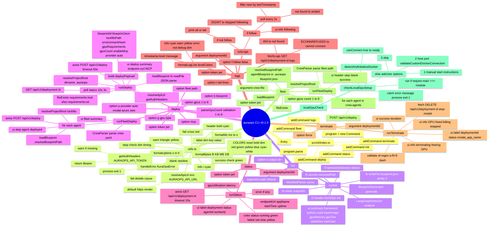
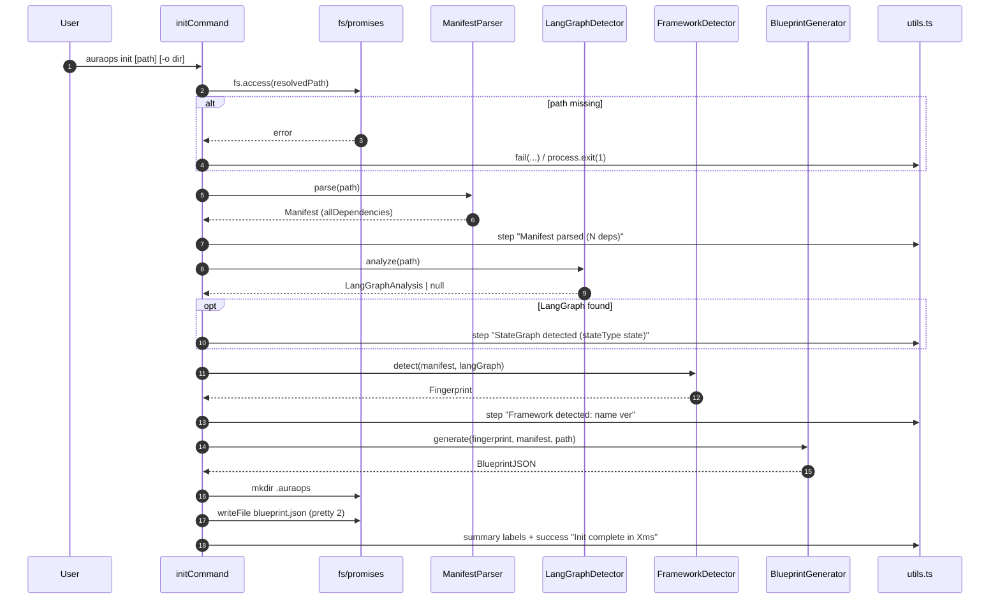
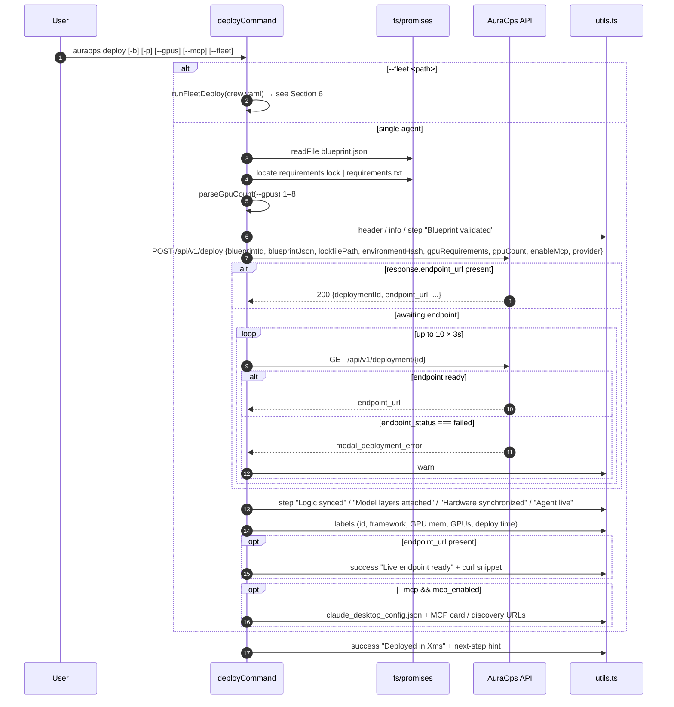
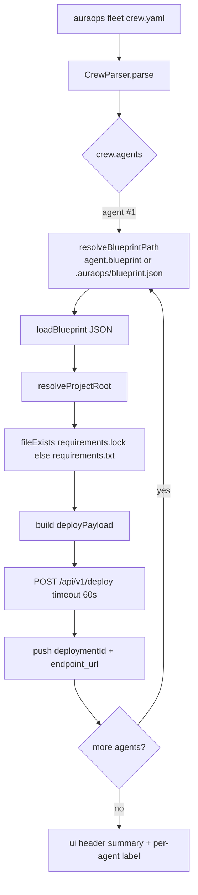
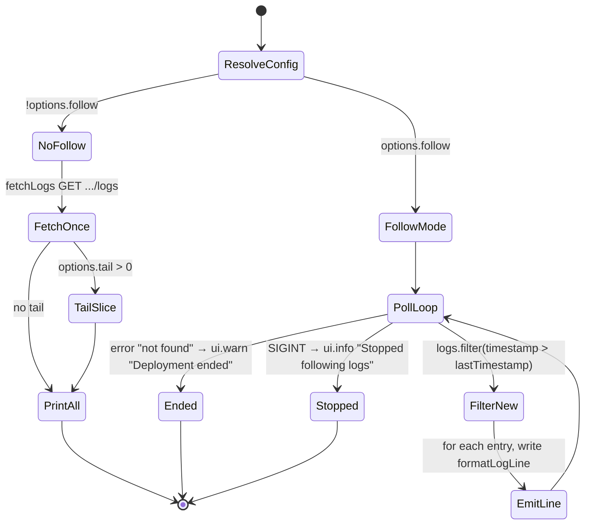
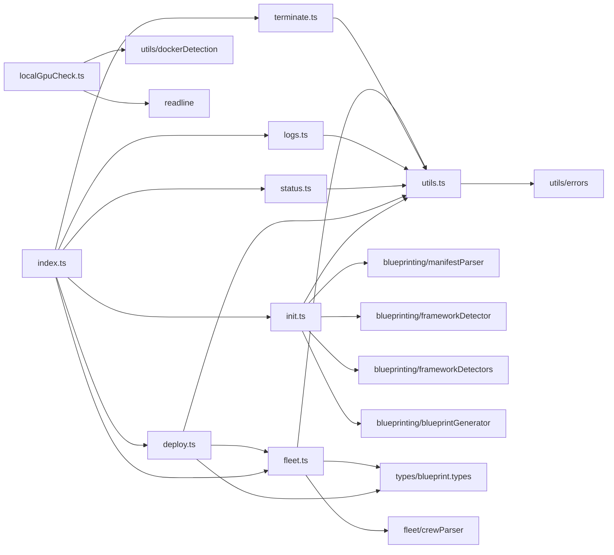
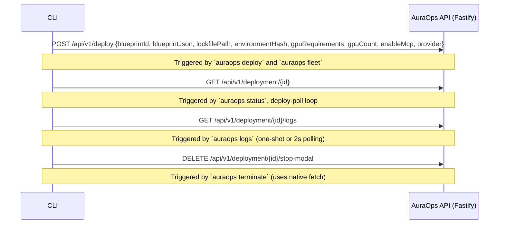
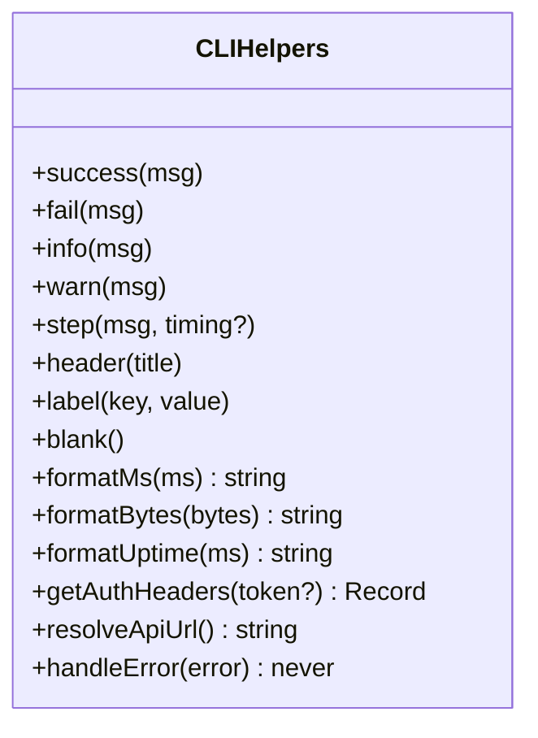

# AuraOps CLI — Deep Code Map

**Entry point:** `src/cli/index.ts` (25 lines) — Commander program `auraops` v0.1.0.
**Source files (973 lines total):** `index.ts` · `init.ts` · `deploy.ts` · `status.ts` · `logs.ts` · `terminate.ts` · `fleet.ts` · `localGpuCheck.ts` · `utils.ts`.
**Shared helper:** `utils.ts` — colour-coded stdout/stderr, formatters, auth header resolver, default API URL, error handler.
**Auth env:** `AURAOPS_API_TOKEN` (or `--token <jwt>`) → `Authorization: Bearer <token>`.
**Default API URL:** `https://auraops-backend-s2gw.onrender.com` (overridable via `AURAOPS_API_URL`).

---

## 1. Command Tree (Commander surface)

```
auraops (v0.1.0)
├── init          [path]                                   Initialize AuraOps for a project
│     └ -o, --output <dir>                                Output dir for blueprint.json (default: <project>/.auraops)
│
├── deploy                                                  Deploy AI agent to GPU
│     ├ -b, --blueprint <path>                             blueprint.json (default: .auraops/blueprint.json)
│     ├ -p, --provider <name>                              auto | modal | azure | aws       (default: auto)
│     ├ -g, --gpu   <type>                                 a100 | h100 | rtx4090
│     ├ --gpus      <count>                                1–8                              (parsed → parseGpuCount)
│     ├ --token     <jwt>                                  (or AURAOPS_API_TOKEN env)
│     ├ --fleet     <path>                                 crew.yaml → multi-agent deploy
│     └ --mcp                                               Auto-generate MCP server endpoint
│
├── status        <deploymentId>                           Check deployment status
│     └ --token <jwt>
│
├── logs          <deploymentId>                           View deployment logs
│     ├ -f, --follow                                        Follow log output (2s poll)
│     ├ -t, --tail   <lines>                                Number of lines from end
│     └ --token  <jwt>
│
├── terminate     <deploymentId>                           Stop deployment, free GPU
│     └ --force                                            Skip confirmation prompt
│
├── fleet         <crew-file>                              Deploy multi-agent crew from crew.yaml
│     ├ --token <jwt>
│     └ --gpus  <count>                                     1–8 (per agent)
│
└── (external: check-local-gpu run via `node dist/cli/localGpuCheck.js`)
```

`deploy --fleet <path>` is an alias branch that delegates to `runFleetDeploy()` from `fleet.ts`.

---

## 2. Mermaid — Full CLI Mind Map



---

## 3. CLI Internal Call Graph

```mermaid
graph TD
  IDX[cli/index.ts<br/>program.parse] --> INIT[initCommand]
  IDX --> DEP[deployCommand]
  IDX --> STA[statusCommand]
  IDX --> LOG[logsCommand]
  IDX --> TER[terminateCommand]
  IDX --> FLE[fleetCommand]

  INIT --> RINIT[runInit]
  RINIT --> MP[ManifestParser.parse]
  RINIT --> LG[LangGraphDetector.analyze]
  RINIT --> FD[FrameworkDetector.detect]
  RINIT --> BG[BlueprintGenerator.generate]
  RINIT --> UI[utils.ts]

  DEP --> RDEP[runDeploy]
  DEP --> RFLE[runFleetDeploy]
  RDEP --> UI
  RDEP --> AX1[axios POST /api/v1/deploy]
  RDEP --> AX2[axios GET /api/v1/deployment id]
  RFLE --> CP[CrewParser.parse]
  RFLE --> AX1
  RFLE --> UI

  STA --> RSTA[runStatus]
  RSTA --> AX3[axios GET /api/v1/deployment id]
  RSTA --> UI

  LOG --> RLOG[runLogs]
  RLOG --> FLOG[fetchLogs<br/>axios GET /api/v1/deployment id logs]
  RLOG --> POLL[poll loop 2s]
  RLOG --> UI

  TER --> RTER[runTerminate]
  RTER --> FTCH[fetch DELETE /api/v1/deployment id stop-modal]
  RTER --> UI

  FLE --> RFLE

  LGPU[localGpuCheck.ts<br/>checkLocalGpuSetup] --> DD[utils/dockerDetection.ts<br/>detectAndInitializeDocker]
  LGPU --> VD[utils/dockerDetection.ts<br/>validateCustomDockerConnection]
  LGPU --> RL[readline question]

  classDef ext fill:#222,stroke:#888,color:#fff;
  class AX1,AX2,AX3,FLOG,FTCH ext;
```



---

## 4. `auraops init` — Pipeline Sequence



---

## 5. `auraops deploy` — Pipeline Sequence



---

## 6. `auraops fleet` — Multi-Agent Loop



---

## 7. `auraops logs` — Streaming State Machine



---

## 8. `auraops status` / `terminate` — Quick Look

| Command | Endpoint | Method | Auth | Notes |
|---|---|---|---|---|
| `status <id>` | `/api/v1/deployment/{id}` | GET | Bearer | Coloured status line; uptime computed client-side from `startTime` |
| `terminate <id>` | `/api/v1/deployment/{id}/stop-modal` | DELETE | Bearer | ID validated `^[a-f0-9-]+$`; `--force` skips "freeing GPU" banner; prints `modal_app_name` on success |

`terminate` is unique: it uses native `fetch` (not `axios`) and reads `AURAOPS_TOKEN` env directly (bypasses `getAuthHeaders`).

---

## 9. Error & Exit-Code Matrix

| Source | Trigger | Behaviour |
|---|---|---|
| `init` | `fs.access` fails | `ui.fail` + `process.exit(1)` |
| `deploy` | axios 4xx/5xx with JSON error | rethrow `Error(error)` → `ui.handleError` |
| `deploy` | `ECONNREFUSED` | rethrow "Cannot connect… Is the server running? Start it with: npm run dev" |
| `deploy` | `--gpus` invalid | `parseGpuCount` throws → `ui.handleError` |
| `status` | HTTP 404 | `Error("Deployment not found: …")` → `handleError` |
| `status` | HTTP 400 | `Error("Invalid deployment ID format")` |
| `logs` | HTTP 404 | `Error("Deployment not found")` |
| `logs` | `ECONNREFUSED` | `Error("Cannot connect …")` |
| `logs` (follow) | 404 mid-poll | `ui.warn("Deployment ended")` then return |
| `logs` (follow) | `SIGINT` | `ui.info("Stopped following logs")` + `process.exit(0)` |
| `terminate` | Invalid id regex | `ui.fail` + `process.exit(1)` |
| `terminate` | HTTP 404 | `ui.fail("Deployment not found …")` + exit 1 |
| `terminate` | HTTP error | `ui.fail("Failed to terminate …")` + exit 1 |
| `fleet` | crew.yaml parse/load fail | bubbles through `ui.handleError` |
| `localGpuCheck` | runtime error | `console.error` + `process.exit(1)` |

`utils.handleError`:
- If `AuraOpsError` → `fail(message)`, print `Details:` and `Cause:`, exit 1.
- If `Error` → `fail(message)`, exit 1.
- Else → `fail(String(error))`, exit 1.

---

## 10. File-to-File Dependency Graph (imports)



---

## 11. External HTTP Surface (CLI → API)



All four endpoints require `Authorization: Bearer <jwt>` (or 401).

---

## 12. Option Sources & Defaults (cheat-sheet)

| Flag | Type | Default | Source precedence | Validation |
|---|---|---|---|---|
| `--blueprint` / `-b` | path | `.auraops/blueprint.json` | CLI > flag | file must exist |
| `--provider` / `-p` | enum | `auto` | CLI > default | `local` → coerced to `auto` |
| `--gpu` / `-g` | string | – | CLI > default | none (passed through) |
| `--gpus` | int | `1` if not from CLI | `gpusSource === 'cli'` requires parse | **1–8** |
| `--token` | jwt | `AURAOPS_API_TOKEN` | CLI > env | none (warn if empty) |
| `--fleet` | path | – | CLI only | file must exist |
| `--mcp` | bool | `false` | CLI only | none |
| `--output` / `-o` | dir | `<project>/.auraops` | CLI > default | dir creatable |
| `--follow` / `-f` | bool | `false` | CLI only | none |
| `--tail` / `-t` | int | – | CLI only | `parseInt` (no range check) |
| `--force` | bool | `false` | CLI only | none |

Note: `parseGpuCount` only enforces range when `gpusSource === 'cli'` — defaults to 1 silently otherwise.

---

## 13. UI Helpers (utils.ts) — Mermaid classDiagram



All formatters escape to either stdout (success/info/step/header/label/blank) or stderr (fail/warn) for proper shell redirection.

---

## 14. Lifecycle & UX Touch Points

- **Pre-flight (init)**: detects framework + LangGraph locally — no API call.
- **Deploy handshake**: synchronous `POST /api/v1/deploy` returns either a ready `endpoint_url` or a `deploymentId`; CLI then polls up to **10 × 3s** for the live endpoint.
- **Observe**: `status` (snapshot), `logs -f` (2s poll stream, SIGINT-safe).
- **Cleanup**: `terminate` (DELETE) — explicit; no auto-rotation.
- **Local dev**: `localGpuCheck` (Docker daemon probe, optional remote host:port) — independent entry point (`node dist/cli/localGpuCheck.js`).
- **Fleet**: dedicated subcommand, but also reachable via `deploy --fleet <path>` shortcut.

---

## 15. Edge Cases Worth Knowing

1. **`logs -f` filter logic**: when no `lastTimestamp` (first poll), CLI emits the *entire* history — a flood on long-running deployments. Use `-t` first.
2. **`status` uptime**: computed client-side from `startTime`; if `startTime` is missing, the label is omitted silently.
3. **`terminate` auth**: reads `AURAOPS_TOKEN` directly (not `AURAOPS_API_TOKEN`) — likely a bug; `getAuthHeaders` elsewhere uses `AURAOPS_API_TOKEN`.
4. **`deploy` 10×3s poll**: hard-coded; deployments that take >30s to surface a URL will not block further — CLI prints "no live endpoint" and exits 0.
5. **`fleet` lockfile fallback**: prefers `requirements.lock` → `requirements.txt` → `""` (server tolerates empty string).
6. **`init` LangGraph**: optional; if absent, step is skipped (no error).
7. **`gpusSource`**: only set to `'cli'` when `--gpus` is on the actual command line; passing it via config/env still defaults to 1.
8. **`localGpuCheck`**: not registered in `index.ts` — only runs if invoked directly via node; not part of `auraops` command tree.

---

## 16. Tiny ASCII Tree (terminal user view)

```
$ auraops
Usage: auraops [options] [command]

Commands:
  init        Initialize AuraOps for a project
  deploy      Deploy AI agent to GPU
  status      Check deployment status
  logs        View deployment logs
  terminate   Stop a running deployment and free GPU resources
  fleet       Deploy a multi-agent crew from crew.yaml
```

